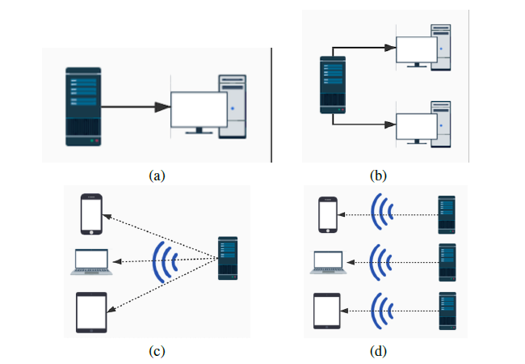

# VideoStream-NS3
The project is designed to provide a simulation of adaptive video streaming over  wireless home networks using ns-3.

## Introduction

### Video Streaming
*Streaming* is a technology used to deliver content from the server to clients over the internet without having to download it. Multimedia streaming is one of the most popular and successful streaming services since it allows the user to watch the video or listen to music almost immediately without having to wait for the file to be completely downloaded. Unlike the file transfer which keeps the file on the device until the user manually deletes it, the streaming data is automatically removed after the user uses it.

### Adaptive Streaming

Traditional progressive video streaming is simply one single video file being streamed over the internet, and the video can be stretched or shrunk to fit different screen resolutions. Regardless of the device playing it, the video file will always be the same. *Adaptive streaming* (also known as Adaptive Bitrate Streaming), instead, is a technique designed to deliver the multimedia contents to the user in the most efficient way and in the highest possible quality for each user. 

## Installation

### Prerequisites
ns-3 (version 3.30), Python (`python 2.7+` or `python 3.5+`), C++ compiler (`clang++` or `g++`)

### How to install

1. Download and build `ns-3` following the official document [here](https://www.nsnam.org/docs/release/3.30/tutorial/singlehtml/index.html#getting-started).
2. Copy the files **exactly** into the folders of the `ns-3`. (Be aware of the `wscript` in `src->applications`, otherwise the video streaming application will not be installed!)
3. Run `./waf` or `./waf build` to build the new application.
4. Run `./waf --run videoStreamer` for the testing program (you can change `CASE` in `videoStreamTest.cc` for different network environments).

### Detailed explanation

[Frank](https://github.com/Frankytx) and I made a YouTube video for explaning what we did for the project. [Check out here!](https://youtu.be/PEvXoRmz3tk) (Sorry for the microphone issue...)

## Results

### Network configurations



- (a) P2P network with 1 server and 1 client
- (b) P2P network with 1 server and 2 clients
- (c) Wireless network with 1 server and 3 mobile clients
- (d) Wireless network with 3 servers and 3 mobile clients

### Case of requesting lower video quality

Set a low bandwidth in `videoStreamTest.cc`, e.g., `2 Mbps`, and you are expected to see the drop of video quality level.

```
(......)
At time 3.5 s: Not enough frames in the buffer, rebuffering!
At time 3.61909s client received frame 15 and 56408 bytes from 10.1.1.1 port 5000
At time 3.85341s client received frame 16 and 57350 bytes from 10.1.1.1 port 5000
At time 4.08793s client received frame 17 and 57400 bytes from 10.1.1.1 port 5000
At time 4.33389s client received frame 18 and 60200 bytes from 10.1.1.1 port 5000
At time 4.5 s: Not enough frames in the buffer, rebuffering!
At time 4.58276s client received frame 19 and 60898 bytes from 10.1.1.1 port 5000
At time 4.7944s client received frame 20 and 51800 bytes from 10.1.1.1 port 5000
At time 5.05752s client received frame 21 and 64400 bytes from 10.1.1.1 port 5000
At time 5.27239s client received frame 22 and 52577 bytes from 10.1.1.1 port 5000
At time 5.5 s: Not enough frames in the buffer, rebuffering!
At time 5.50119s: Lower the video quality level!
(......)
```

### Case of requesting higher video quality

Set a high bandwidth in `videoStreamTest.cc`, e.g., `100 Mbps`, and make sure the video length is longer than 5 seconds, then you are expected to see the increase of video quality level.

```
(......)
At time 2.5349s client received frame 120 and 277397 bytes from 10.1.1.1 port 5000
At time 2.55769s client received frame 121 and 278819 bytes from 10.1.1.1 port 5000
At time 2.58043s client received frame 122 and 278288 bytes from 10.1.1.1 port 5000
At time 2.60336s client received frame 123 and 280667 bytes from 10.1.1.1 port 5000
At time 2.61411s client received frame 124 and 131446 bytes from 10.1.1.1 port 5000
At time 2.61411s: Increase the video quality level to 4
(......)
```

## Issues

- We noticed that the mobile devices will lose connection to the server when it moves out of the range of wireless signals. However, we did not observe the transmission rate dropping when the mobile devices are away from the sever, which requires further investigation on how different modes work in the ns-3 wireless simulator. 
- Due to the time limitation, we did not use the real video files for the transmission. It is also a good feature to add some decoders of video file formats to the application.

## References 

1. The ns-3 development team, “ns-3 network simulator.” https://www.nsnam.org/docs/release/3.32/tutorial/html/ introduction.html. Accessed: 2020-11-28. 
2. X. Zhu and B. Girod, “Video streaming over wireless networks,” in 2007 15th European Signal Processing Conference, pp. 1462–1466, IEEE, 2007. 
3. A. Fouda, A. N. Ragab, A. Esswie, M. Marzban, A. Naser, M. Rehan, and A. S. Ibrahim, “Real-time video streaming over ns3-based emulated lte networks,” Int. J. Electr. Commun. Comput. Technol.(IJECCT), vol. 4, no. 3, 2014. 
4. T.-Y. Huang, R. Johari, N. McKeown, M. Trunnell, and M. Watson, “A buffer-based approach to rate adaptation: evidence from a large video streaming service,” in Proceedings of the 2014 ACM conference on SIGCOMM, SIGCOMM ’14, pp. 187–198, Association for Computing Machinery, 2014. 
5. L. Liu, H. Hu, Y. Luo, and Y. Wen, “When Wireless Video Streaming Meets AI: A Deep Learning Approach,” IEEE Wireless Communications, vol. 27, pp. 127–133, Apr. 2020.
